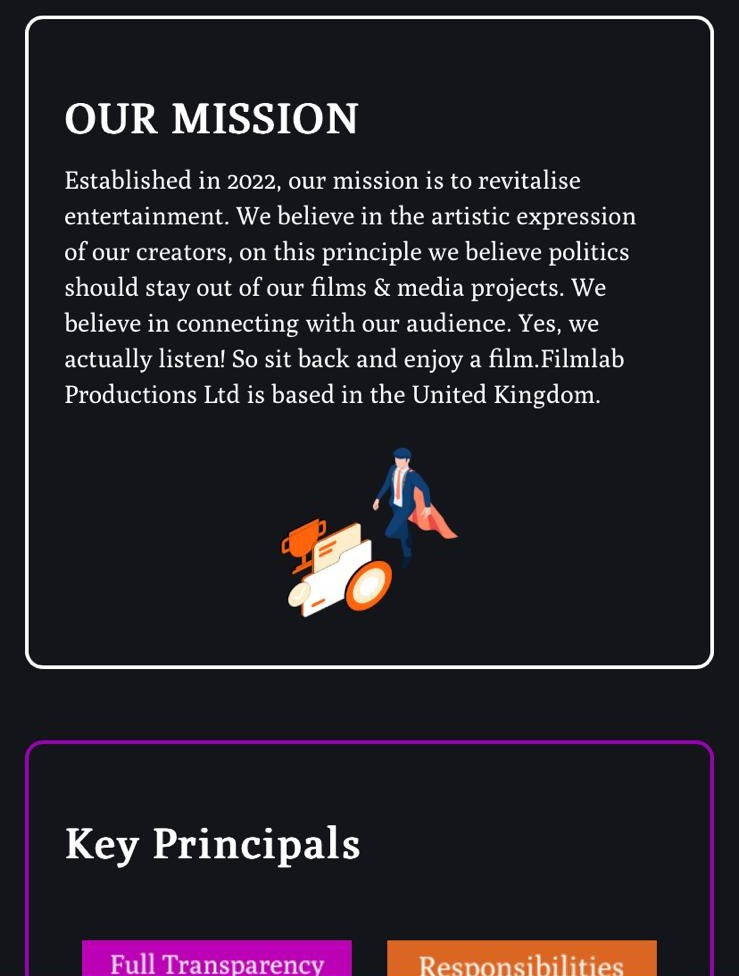

# Filmlabproductions

Filmlab Productions is a film website where Filmlab is able to post its content to its viewers. The site is used as a networking and video streaming platform. Also to reduce the bandwith load on servers, videos may be hosted on other streaming platforms, such as youtube. 

Main page -> index.html

The purpose of this page is to hold video content (trailers, short films & future releases) of my hobby film company "Filmlab Productions" 

[Link to live webpage](https://filmlabproductions.co.uk)

## Getting Started: Wireframing my project:

Initially I had a completely different idea for the website. I had intended on using waves on the top for the navigation, with a more colourised aesthetic on the about us page.
    
I then designed it on Figma with these as the results
    
    
## Color and Styling
I had planned to use a primary color scheme of black; purple, and a accent of orange. I also intended to use css to have a wave format for page seperation as seen here:

My design was started on pencil and paper -> then moved to figma as a free tool that I would be able to see my design before committing to it in code.

Upon finishing the design it had 3 major issues:

 1) Color scheme -
 2) Media icons -
 3)

1- While commiting to the colour scheme, I wanted to remove elements that created visual noise, or affected readability for the user. I also wanted to cut down on colours outside of the primary colours (Grey & White)

## Prerequisites to project:

Before starting my project I had had to understand the constraints of my project and the time limitations placed upon me. I would have a month and a half to design and develop my website.

## Acknowledgements

## Testing

All content is made by me Armando Halilaj, support resources I have used are:
    - stack overflow (other people's questions - e.g. understanding the scaling aspect-ratio of the Iframes of my videos)
    - w3schools
    - Youtube (Grid & flexbox)

index.html (Filmlab - Homepage):
    HTML:
    CSS:

about.html (Filmlan - About):

    Initially starting with a mobile-first approach, 
    
    Bugs:

        I had no issues here until I ran into problems with the ".bubble" class. I tried to fix this by having the background wrap more closely with the text, and aligning content with flex to the center of the box. This had fixed one issue but also left all of the bubbles as the same size, as can be seen in the image below:

navbar ()
    HTML:
        All navbar information is located at the beggining of the body of each HTML folder. 
        
        
        When starting my project, my primary focus was on completing the navbar as it would be the most challenging part of my project. I would have to not only master the required media quiries to make it responsive on both mobile and desktop devices
        
        Initially I tried to make the navbar 
    CSS:

Reason for my commit being later in the project:
     Initially when I started writing the code for this website, it was during the start of the course. During this period I had not learnt about github and was spending half my time working through the cirriculum, the other half was getting practical experience by writing unique-code on a project I am passionate about. Since I only learnt how to use Git later on in the project, I would only know how to commit my code once I reached that part in the course.

Bugs:
    Along my journey I had experienced a great number of bugs and unintended consequences in the user experience. This ranged from elements which did not display at all, to elements covering the entirety of the screen: 

    
    Inconsitent text displays between films.html and the corresponding film pages:
    