# FILMLAB PRODUTIONS
---
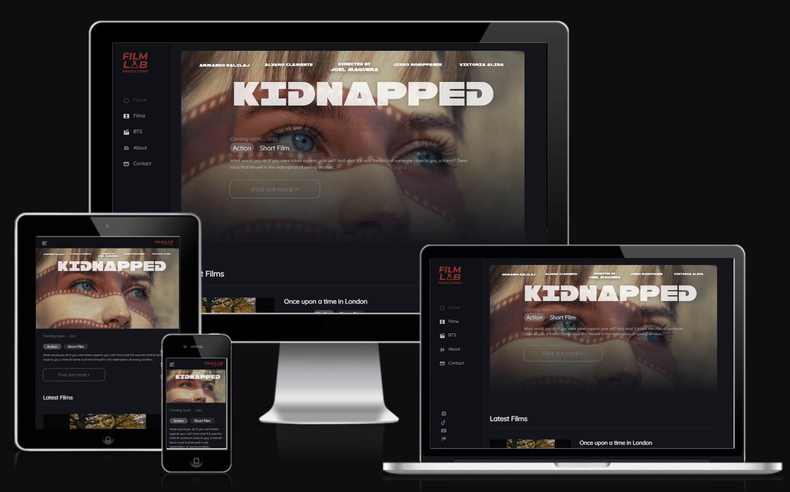

  

[View My Github Project on 'Pages'](https://armandoh4.github.io/filmlabproductions/) -  This version of my site that is being assessed.

[View My Github Project on 'Heroku'](https://git.heroku.com/filmlab.git)

[View My Github Project on 'Heroku'](https://filmlabproductions.vercel.app)

[Real Company's Webpage](https://filmlabproductions.co.uk) - This link is live, however does not have the capacity to use flask due to the hosting party not allowing it. This will run on the build made with just HTML, CSS & JavaScript

Login Details for testing admin priveliges (IE. Being able to add or edit films) Heroku:
    User: admin
    Password: adminpassword

---
## Introduction
    Filmlab Productions (Filmlab) is a film production website where users stay up to date with current projects. The site is multifunctional, as a video streaming platform, enabling audiences to stay up to date on what Filmlab is doing. Users may stay up to date via the homepage, which houses an up to date film list, and a behind the scenes page.

    Filmlab is a new company so it is vital that they are able to quickly show what they are about, and their films must come to the focus to build an audience. Therefore, a thoughtful design would take into consideration, the companies' appetites  for releasing films, along with the viewer's attention to watching them.
---
## CONTENTS:
---
* [User Experience - UX](#user-experience) 
    * [First Time Visitor GOAL](#first-time-visitor-goal)
    * [Return Visitor GOAL](#returning-visitor-goal)

* [Design](#design)
    * [Wireframing](#wireframing)
    * [Colour Scheme and Styling](#colour-scheme-and-styling) 
    * [Typography](#typography)
    * [Features](#features)
    * [Consolidating the Design](#consolidating-design)

* [Features](#features)
    * [Future Implementations](#future-implementations)

* [TESTING](#testing)

* [BUGS](#bugs)
  * [Known Bugs](#known-bugs)
  * [Solved Bugs](#solved-bugs)

* [Acknowledgments](#acknowledgments)

---
## User Experience:

### First Time Visitor GOAL

     1 - To quickly find out what projects Filmlab is working on

     2 - To find out if filmlab is a legitimate business along with their track record with film making

     3 - To be able to navigate to the films section and watch the projects, possibly after seeing potential advertisements or anticipation on social media for a new film

     4 - To find out information on the team behind filmlab, follow the careers of actors involved, where the company is based, and to contact the company directly

     5 - What the company is about and how they work together to produce films
    
### Returning Visitor GOAL

     1 - To navigate around and see the newest projects & films, or upcoming projects on the very front of the homepage

     2 - To be able to see up to new images on the behind the scenes page, with new content about upcoming or completed projects, that they care about

     3 - Actors or producers who want to share their work

     4 - Creator's goals are different than the regular user. This user would be more interested in publishing their work, rather than watching. These users would demand an admin account where they can upload, edit and delete videos from the database. Login details are listed in the *[Introduction](#Introduction)

---
## Design:

### Wireframing
            
* Navigation - The idea was to make the nav constantly visible on larger screen devices, but open with as a menu, for mobile users

    .jpg)

* Home - This needs an eye-catching first image, to keep users on the page, similar to how Netflix uses a main. It also would require the ability to navigate through films 

    .jpg) 
    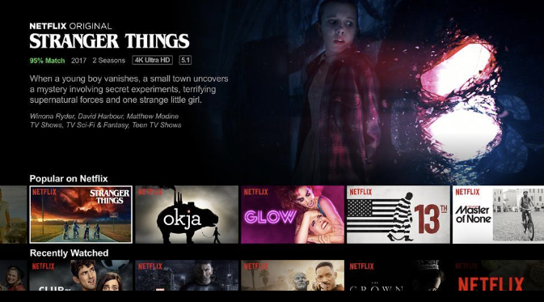

* Films - I tried to reuse the same elements from the homepage, to reduce the complexity of the project

    .jpg)

* Watch Films - This will be the page of a selected film, and will include a description and a trailer (if available)

    .jpg)

* Behind the Scenes - This will have all the images for projects, and will have a 'previous' and 'next' button, for intractability between slides

    .jpg)

* About Us - This will be a section to credit the team & demonstrate their respective roles

    .jpg)

* Contact Form - Note that unfortunately, this did not get passed the wireframe, as I did not know how to receive messages from a static page

    .jpg)

 ### Colour Scheme and Styling
    Originally, I had planned to use a primary color scheme of black; purple, and an accent of orange to outline important content. However, Filmlabs' final colour scheme is heavily inspired by Netflix and their simple, red, black and grey website design.

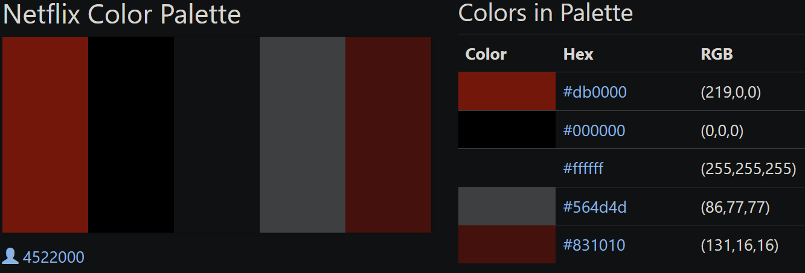
    Screenshot from - https://www.color-hex.com/color-palette/22942

    Based on my previous statement and using the colour selector tools on Figma.com, the colours I decided to settle on were the following 3:

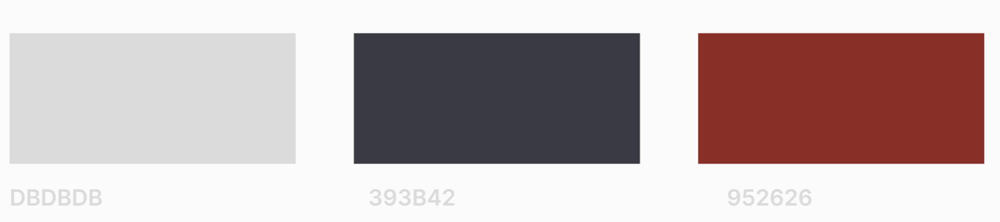
    Screenshot from - https://www.color-hex.com/color-palette/22942

    My design was started with pencil and paper -> then moved to Figma as a free tool that I would be able to see my design before committing to it in code.

    While committing to the colour scheme, I wanted to remove elements that created visual noise, or affected readability for the user. I also wanted to cut down on colours outside of the primary colours (Grey & White). This was so I can maintain continuity with the rest of my site, along with having a more professional looking site.

### Consolidating Design
    After completing the wireframing stages I had assistance from a designer. These are examples of the PC mockup, used to envision how Filmlab would look.
    Pc version (designed by Natsuko - my friend)
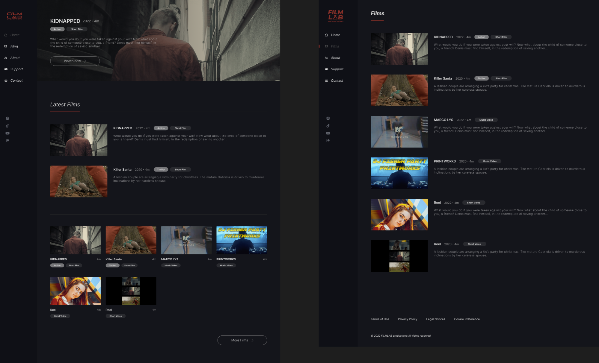
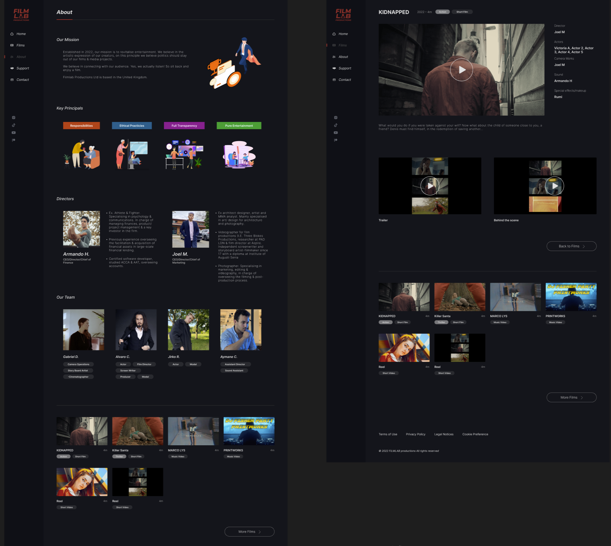

### Home Page (Final Look)

* For the home page, I took into account the user who wants to see what films are in production, therefore I wanted something eye-catching, a teaser for the audience. But I also wanted the page to stand out and be informative. Explaining the choice of imagery

### Film Page (Final Look)
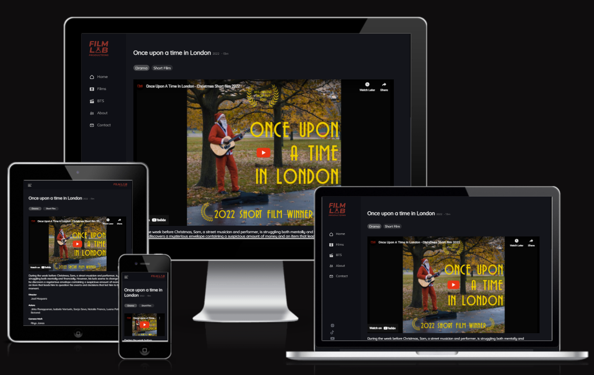

### Films Page (Final Look)
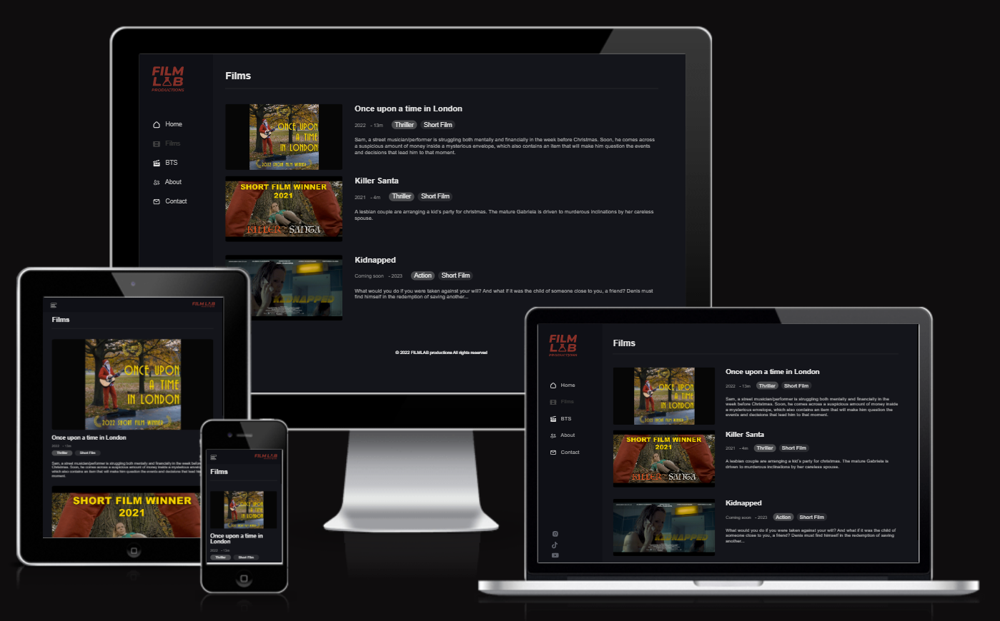

    When working on the final design, I used an online editing tool called Figma. I also used it to edit and resize SVG images, due to its inbuilt features and high precision over such properties. This is how I redesigned my Icons.
        
    Initially, I had designed the navigation as it would be used in all of my pages. I went for a more modern approach, opting for a sidebar, similar to Netflix.

### Typography
    I used google fonts' "Quicksand" for better readability, as its roundness makes it easier to read. It also adds a more delicate and comfortable feel, which is ideal for relaxing users, who are ready to watch a film.
---
## Features:
---

* Logo - Clickable functionality, brings user to home page

    * PC - Visible on the top left of the webpage with the feature of always bringing the user to the homepage
        
        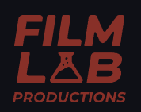

    * Mobile - Visible on the top right of the navigation bar

        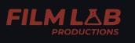

* Navigation

    * Mobile Burger Menu - Located on the top left of the mobile navigation bar, clicking this will open the navigation menu. This element suses the mouse hover attribute

        

    * Mobile X Icon - Replacing the general position of the Burger Icon, clicking this will close the mobile/tablet navigation. This element uses the mouse hover attribute
    
         

    * Side Pannel - Containing 4 page links. A transparancy filter is applied to the active corresponding link, hovering also darkens corresponding elements
        
        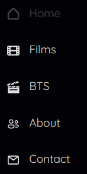 

    * Social Media Icons - Opens a new tab, using the "_blank" attribute 
        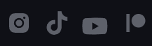

        1 - Upon hovering, each link will transition into an animation to their corresponding colour (I.E. Purple for Instagram. Orange for Patrion. Red for YouTube. Blue for Tiktok) I achieved this effect by using a filter and adding a transition period to the hover pseudo-class

        
        
        
        

    All navbar information is listed-out on the left side of the body, on each page. 
        
    * Navigation now contains the Admin Login Page - allowing the user to edit the films list without looking into the code
        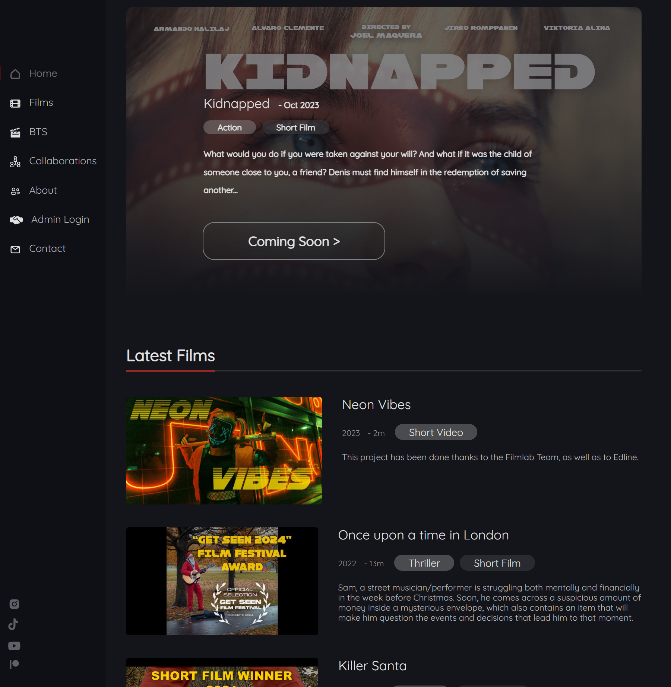

    The Login Feature is enabled through Python/Flask and the login details are given above.
        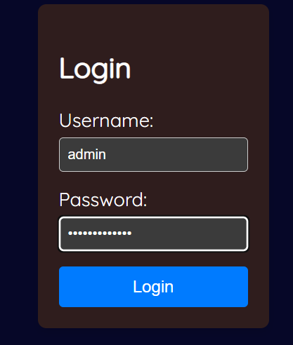

    There is now a page to edit, add or delete Films:
        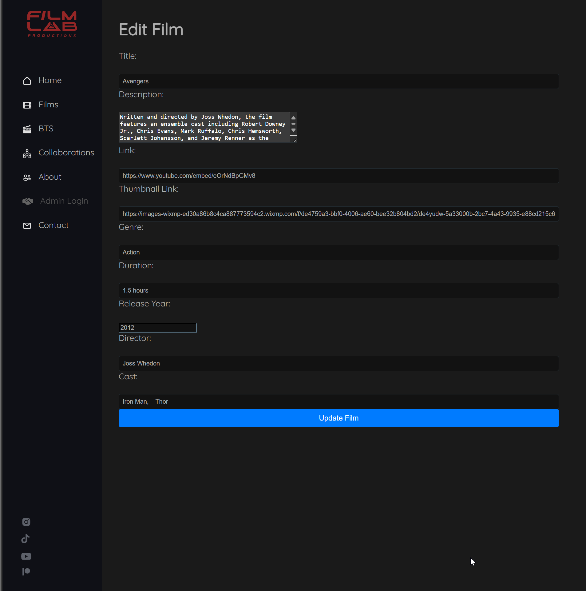
        

### Future Implementations
    In the future I would like to implement a proper "contact us" form, instead of the slapdash method of opening the email app, which is in place now. I would also like to add animations to the project, for example, when the navbar opens or closes, as it would add more fluidity to the page. I would also like to implement a feature called 'Randomiser' in the navigation bar, which would select a random film from the current list.

### Accessibility

    While I have not added aria-labels to enable screen readers to understand my webpage, I have ensured that my code is semantic enough and I have ensured there is adequate contrast for ideal readability. However, I understand the need to make my site more accesible to visually impared users, through screen readers.

---
## Testing:

[Testing found here](TESTING.md)
---
## Bugs:

### Known bugs:

    I have an issue with the display of the navigation, social media Icons appearing too far down on the very niche laptop model. This was a problem I only noticed when testing with different viewport heights, on different devices. The fix for this would be simple, reduce the margin in the above element, and align content absolutely from the bottom of the screen, rather then cascading down from the top.

    Another issue I was unable to fix was, once I use navigation & swaps from tablet mode to peace mode. There, the contents do not change their states back to its default.
    
    I was unable to fully integrate the Admin interface witth the rest of the site. I also had problems when I converted the data from my HTML into Python so there are broken links and and images which I have not been able to adress properly. These only occured after switching. After submission I will also be working on it in a seperate branch as a challenge to myself and to understand the underlying issues with my code. This was a problem due to my time being too short and not having the opportunity to test all features manualy.

    Another bug faced was that on pages outsidr the home page, there 

### Fixed Bugs:
    In my About page, I had no issues here until I ran into problems with the ".bubble" class. I tried to fix this by having the background wrap more closely with the text, and aligning content with flex to the center of the box. This had fixed one issue but also left all of the bubbles as the same size. It is mostly fixed however.

    Along my journey I had experienced a great number of bugs and unintended consequences in the user experience. This ranged from elements which did not display at all, to elements covering the entirety of the screen.
---
##  Acknowledgments:
---
* Credits to Natsuko, the designer who helped me with the logo, and who was a big help in designing the site.

* Logo - Designed by Natsuko for this project in Figma 

    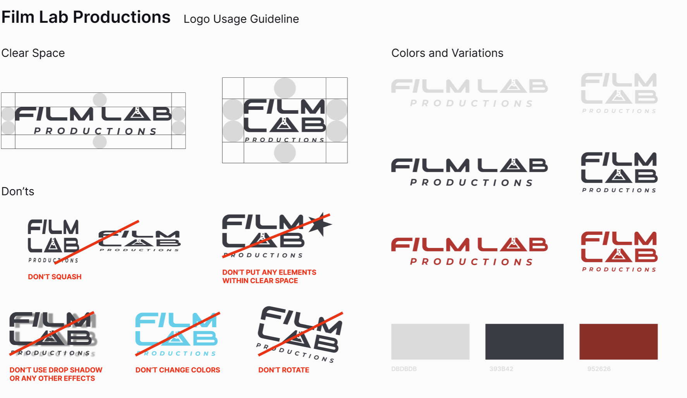

* I used the filters from [here](https://codepen.io/sosuke/pen/Pjoqqp), allowing me to easily apply the right filter to make the hover effect animation on my svg match the intended colour, with minimal trial and error on my end.  

    

* When working on Filmlab, I had issues with the javascript. Primarily with regards to adding a behind the scenes (bts.html) image carousel, with autoscroll functionality. Because of that, I used this video as inspiration for my BTS page https://www.youtube.com/watch?v=9HcxHDS2w1s

* I then added onto it using chat GPT, asking it to add a timer for an autoscroll.

* For the cards on my about us (directors), I had assistance from an online news article, however I can not find it anymore, unfortunately.

### Reason for my commit being later in the project:
    Initially when I started writing the code for this website, it was during the start of the course. During this period I had not learnt about github and was spending half my time working through the curriculum, the other half was gaining practical experience by writing unique-code on this project. Since I only learnt how to use Git later on in the project, I would only know how to commit my code once I reached that part in the course.