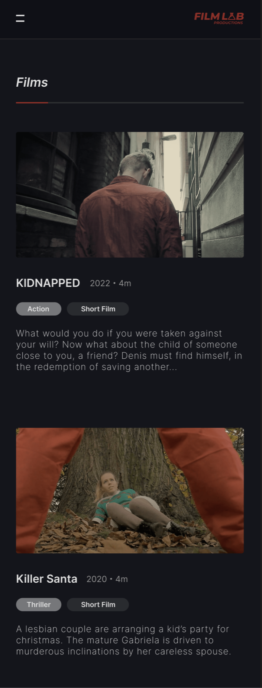
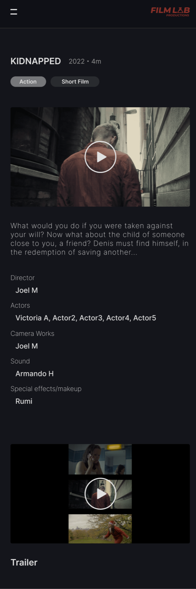

# My First Project - FILMLAB PRODUTIONS
---
[View My Github Project on 'Pages'](https://armandoh4.github.io/filmlabproductions/) -  This version of my site that is being assessed.

[Real Company's Webpage](https://filmlabproductions.co.uk) - This link is live, and may change beyond the date of submision

## Overview

## Introduction
    Filmlab Productions (Filmlab) is a film production website where users stay up to date with current projects. The site is multifunctional, as a video streaming platform, enabling audiences to stay up to date on what Filmlab is doing. Users may stay up to date via the homepage, which houses a up to date film list, and a behind the scenes page.

    Filmlab is a new company so it is vital that they are able to quickly show what they are about, and their films must come to the focus to build an audience. Therefore a thoughtful design would take into consideration, the companies appitite for releasing films, along with the viewers attention to watching them.
---
## CONTENTS
---
* [User Experience](#user-experience-ux) 

* [Design](#design)
    * [WIREFRAMING](#wireframing)
    * [Colour Scheme](#colour-scheme) 
    * [Typography](#typography)
    * [Features](#features)
    * [Consolidating the Design](#consolidating-the-design)

* [Features](#features)

* [AUTOMATED TESTING](#automated-testing)
  * [W3C Validator](#w3c-validator)
  * [Jigsaw](#jigsaw)
  * [WAVE](#wave)

* [TESTING](#manual-testing)
  * [Testing User Stories](#testing-user-stories)
  * [Full Testing](#full-testing)

* [BUGS](#bugs)
  * [Known Bugs](#known-bugs)
  * [Solved Bugs](#solved-bugs)

---
## User Experience UX
---
    First time visitor Goals:

        1- To quickly find out what Filmlab is up to, what the company is about and how they work together to produce films

        2- To find out if filmlab is a legitimate business and their trackrecord with film making

        3- To be able to navigate to the films section and watch the projects, possible after seeing potential advertiments or antisipation on social media for a new film

        4- To find out information on the team behind filmlab, follow the carrers of actors involved, where the company is based, and to contact the company directly
    
    Frequent visitors:

        1- To navigate around and see the newest project & films, or upcoming projects on the very front of the homepage

        2- To be able to see up to new images on the behind the scenes page, with new content about upcoming or completed projects, that they care about

---
### User Strories:

Investors who are lookinmg into the activities of the business.

* Investors
    As an investor who is looking for upcoming projects, the ability to see previous work, along with a description of who was involved is invaluable. I believe filmlab productions acomplishes this well, with its intuitive design and the attention to detail I have put into the sesign of each icon with relation to the page. All pages are linked together in some way, and you will always be able to find the films at the bottom of the page.

* An investor would be most interested in the involvement of the producers in each project, along with their corresponding roles. This is easily accesible underneath the description of the film, where it describes who was involved and their social media adress. However, while investors will have an inherant interest in contacting the company directly. To navigate to this section, there is one method. To go to the navigation bar, on the left and it opens the email. However, this may not be the best experience as it takes the user off the page.
     
      This is easily accomplished through the "Contact us" hyperlink. However as this takes the user to another app, it has its flaws as a system

* For new viewers the site navigation toward the films section is also the most important feature for such a website. This would be the most important feature for a new company, looking to establish its audience. The landing page is engaging and bright. Perfect for a new user to figure out the site.

* Returning visitors will be able to stay up to date with the Behind The Scenes (BTS) page and the home page photo is always up to date with the newest film, so it is easy to stay up to date. 
---

## Design
---

* ### Wireframing
            
     * Navigation - The idea was to make the nav constantly visible on larger screen devices, but open with as a menu, for mobile users

        .jpg)

    * Home - This needs an eyecatching first image, to keep users on the page, similar to how Netflix uses a main 

        .jpg) 

    * Films - I tried to reuse the same elements from the homepage, to reduce the complexity of the project

        .jpg)

    * Watch Films

        .jpg)

    * Behind the Scenes - This will have all the images for projects, and will have a previous and next button, for interactability

        .jpg)

    * About Us - This will be a section for the directors and team to shine

        .jpg)

    * Contact Form

        .jpg)

 * ### Colour Scheme

    Originaly, I had planned to use a primary color scheme of black; purple, and a accent of orange to outline important content. However, Filmlabs' final colour scheme is heavily inspired by Netflix and their simple red, black and grey website design. 

     Colour scheme credits - https://www.color-hex.com/color-palette/22942

    Based on my previous statment and using the colour selector tools on Figma.com, the colours I decided to settle on were the following 3:

    

* ### Typography

    I used google fonts' "Quicksand" for better readability, as its roundness makes it easier to read. It also adds a more delicate and confortable feel, which is ideal for relaxing users, who are ready to watch a film.

* ### Consolidating the Design

    When working on the final design, I used an online editing tool called Figma. I also used it to edit and resize SVG images, due to its inbuilt features and high precision over such properties. This is how I redesigned my Icons.
        
    * Initially I had designed the navigation as it would be used in all of my pages. I went for a more modern approack, opting for a side bar, similar to netflix

    
    * For the home page I wanted something eyecatching, a teaser for the audience. But I also wanted the page to stand out and be informative. Explaining the choice of imagery
    
* Similar to the previous page, this one has a list of films, so the user has a choice upon scrolling through the site.

* This nxt page is when the user clicks on the page themself and is looking toenjoy one of Filmlab's projects. The media player has good accesibility and does not autoplay, leading to a good user experience

* As one can see, there is also a feature for trailers

* Here is the design for the about us page, I wanted to quickly mention the companies goals and mission statment

* Below is a continuation of the mobile about us page, I wanted to keep it in line with the design of ther other section, mainly the film page. Thus the boxy look

* Here is the final Mobile design, and it demonstrates the list of films at the end of each page

Pc version (designed by Natsuko - my friend)

---
### Features

* Logo - Clickable functionality, brings user to home page

    * PC - Visible on the top left of the webpage with the feature of always bringing the user to the homepage
        
        

    * Mobile - Visible on the top right of the navigation bar

        

* Navigation

    * Mobile Burger Menu - Located on the top left of the mobile navigation bar, clicking this will open the navigation menu. This element uses the mouse hover attribute

        

    * Mobile X Icon - Replacing the general position of the Burger Icon, clicking this will close the mobile/tablet navigation. This element uses the mouse hover attribute

         

    * Side Pannel - Containing 4 page links. A transparancy filter is applied to the active corresponding link, hovering also darkens corresponding elements

         

    * Social Media Icons - Opens a new tab, using the "_blank" attribute 

        

        * Upon hovering, each link will transition into an animation to their corresponding colour (I.E. Purple for Instagram. Orange for Patrion. Red for Youtube. Blue for Tiktok) I achieved this effect by using a filter and adding a transition period on the hover psuedo-class

        
        
        
        

    All navbar information is located at the beggining of the body of each HTML folder. 
        
    When starting my project, my primary focus was on completing the navbar as it would be the most challenging part of my project. I would have to not only master the required media quiries to make it responsive on both mobile and desktop devices

If you want to add optional [shields.io](https://shields.io) badges to your README, I like to add them to this section.

👩🏻‍💻 View an example of a completed design section [here](https://github.com/kera-cudmore/earth-day-hackathon-2022#Design)

---
### Colour Scheme
---

### Typography

If you've imported fonts to use in your project, add some information about them here. You can include information like:

Why did you choose the font you have?
Is this an accessibly friendly font?
What weights have you included?

I also like to include an image of the fonts chosen as a reference.

[Google Fonts](https://fonts.google.com/) is a popular choice for importing fonts to use in your project, as it doesn't require you to download the fonts to use them.

### General features on each page

If there is a feature that appears on all pages of your site, include it here. Examples of what to include would the the navigation, a footer and a favicon.

I then like to add a screenshot of each page of the site here, i use [amiresponsive](https://ui.dev/amiresponsive) which allows me to grab an image of the site as it would be displayed on mobile, tablet and desktop, this helps to show the responsiveness of the site.

### Future Implementations

In the future I would like to implement a proper "contact us" form, instead of the slapdash method of opening the email app, which is in place now. I would also like to add animations to the project, for example, when the navbar opens or closes.  

### Accessibility

While I have not added aria-labels to enable screen readers to understand my webpage, I have ensured that my code is semantic enough and I have ensured there is adequate contrast for ideal readibility. 

### Languages Used

HTML, CSS & Javascript

---
## Testing

Jigsaw CSS Validation:
    
| Bug (class)   | Error  | Soloution & Result |
| :------------ |:---------------| :-----|
|.oneByOne|"Too many values or values are not recognized : 20px 1em"| By removing the additional "1em" nothing visible on the page changed |
|.inLine .mainTitle|"Value Error : text-align centre is not a text-align value : centre"|I fixed the typo of "center", however this still does not impact the webpage visually|
|.pcLogo |centre is not a align-items value : centre| This was tghe same issue as above, but once it was resolved, the effect was noticable, as the pc logo now sat in the middle of the nav-bar, as it was intended to|
|.navbar-nav|in is not a transition value : transform 0.4s ease in |I removed this because the code was meant to create a transition between the navbar sidepannel appearing and diappearing, however, it did not function in this way |

The following errors do not effect my code in any meaningful way and by removing this code, my website would loose featues. For example, code such as "-webkit-tap-highlight-color: transparent;" can have a positive effect on the webpage, such as removing the blue box when a button on mobile is clicked, improving mobile UX.

W3C HTML Validation:

    * index.html

| Error | Soloution & Result |
| :-------- | :-----|
|Element ul not allowed as child of element ul in this context|I changed the "ul" to "li" and the error was resolved in all navigations across all my pages  |
|An img element must have an alt attribute, except under certain conditions |I added "alt" tags to each image element, to resolve this error |
|Element p6 not allowed as child of element section in this context |To resolve the issues of "p" child elements not being able to be held in "section" I changed the "p6" element to a "div" |

    * films.html

| Error | Soloution & Result |
| :-------- | :-----|
|a tag not nested correctly|I used a span to wrap the inner contents of the a attribute|
|Element summary not allowed as child of element div in this context | I changed the "summary" element to a "section" as it is considered more correct |
|Element h1 not allowed as child of element span in this context |I changed the h1 element to a div, as the h1  |
|Error involving "p" not being allowed as child of element span in this context| The "p" element cannot be a child of a "span" element. Instead, I swapped the more semantic elements with "span" elements, to reduce the amount of errors. However, as this caused spacing issues due to span being a block type element, I switched to using divs, similar to the home page film tiles|

    * about.html

| Error | Soloution & Result |
| :-------- | :-----|
| br not allowed as child of element ul |I removed all "br" tags which spaced out the "li", instead I added a new class to replace this function|
|Element summary not allowed as child of element section |I changed the semantic element to div|
|Issues of open tags, for example, the "main" tag was open, and so was "section"| I fixed it by finding where these tags opened, and closing them|

    * bts.html

| Error | Soloution & Result |
| :-------- | :-----|
| Attribute src not allowed on element button|Since src is not the correct element to apply to a button I applied the img tag instead |

    * Films section | Kidnapped |Killer Santa | Once Upon a Time

| Error | Soloution & Result |
| :-------- | :-----|
| Attribute src not allowed on element button|Since src is not the correct element to apply to a button I applied the img tag instead |
|The frameborder attribute on the iframe element is obsolete|Since the value of the item was 0, it was unnecesarry to include any further|
|Error from using "p5" as a child element for a "ul"|To counteract this I changed the child to "li" and targeted the new list items with the following properties "list-style: none; display: inline;" so they behave as they did before|
|Error: No li element in scope but a li end tag seen|Deleted surplus "li" tag|

Start as you mean to go on - and get used to writing a TESTING.md file from the very first project!

 however if you start using a TESTING.md file from your first project you will thank yourself later when completing your later projects, which will contain much more information.
  
Use this part of the README to link to your TESTING.md file - you can view the example TESTING.md file [here](testing.md)

#### Final design

## Credits

👩🏻‍💻 View an example of a completed Credits section [here](https://github.com/kera-cudmore/BookWorm#Credits)

Credits to Natsuko, the designer who helped me with the logo, and who was a big help in designing the site.

I used the filters [here](https://codepen.io/sosuke/pen/Pjoqqp) for allowing me to easily apply the right filter to make the hover effect animation on my svg work, with minimal trial and error.

Logo - Designed by a collegue for this project (Credit - Natsuko)
[Natsuko logo](assets/readme_img/logos.png)

###  Acknowledgments

When working on Filmlab, I had issues with the javascript. Primarily with regards to adding a behind the scenes (bts.html) image carousel, with autoscroll functionality I used this video as inspiration for my BTS page https://www.youtube.com/watch?v=9HcxHDS2w1s

I then added onto it using chat GPT, asking it to add a timer for an autoscroll.

For the cards on my about us (directors), I had assistance from an online news article, however I can not find it anymore, unfortunately.

## Getting Started: Wireframing my project:

Initially I had a completely different idea for the website. I had intended on using waves on the top for the navigation, with a more colourised aesthetic on the about us page.
    
I then designed it on Figma with these as the results
 
## Color and Styling

My design was started on pencil and paper -> then moved to figma as a free tool that I would be able to see my design before committing to it in code.

Upon finishing the design it had 3 major issues:

1- While commiting to the colour scheme, I wanted to remove elements that created visual noise, or affected readability for the user. I also wanted to cut down on colours outside of the primary colours (Grey & White)

---
#### Reason for my commit being later in the project:
     Initially when I started writing the code for this website, it was during the start of the course. During this period I had not learnt about github and was spending half my time working through the cirriculum, the other half was getting practical experience by writing unique-code on a project I am passionate about. Since I only learnt how to use Git later on in the project, I would only know how to commit my code once I reached that part in the course.

---
#### Bugs:
    In my About page, I had no issues here until I ran into problems with the ".bubble" class. I tried to fix this by having the background wrap more closely with the text, and aligning content with flex to the center of the box. This had fixed one issue but also left all of the bubbles as the same size. It is mostly fixed however.

    Along my journey I had experienced a great number of bugs and unintended consequences in the user experience. This ranged from elements which did not display at all, to elements covering the entirety of the screen.
---
#### Known bugs

    I have an issue with the display of the navigation, social media Icons appearing too far down on the pc versions. This was a problem I only noticed when testing with different viewport heights.

    Another issue I was unable to fix was, once I use navigation & swaps from tablet mode to pc mode. There the contents do not change their states back to its default. This 

    I am currently encountering an issue with the film pages only, where after validating my code the navigation burger menue does not appear. I have tried fixing it but was unable to do so
